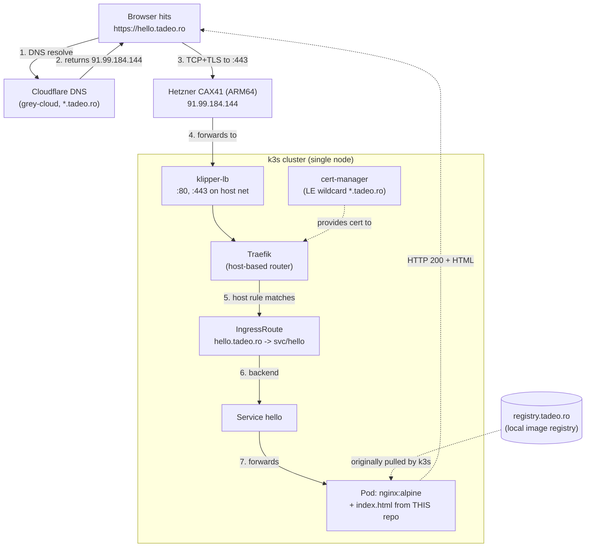
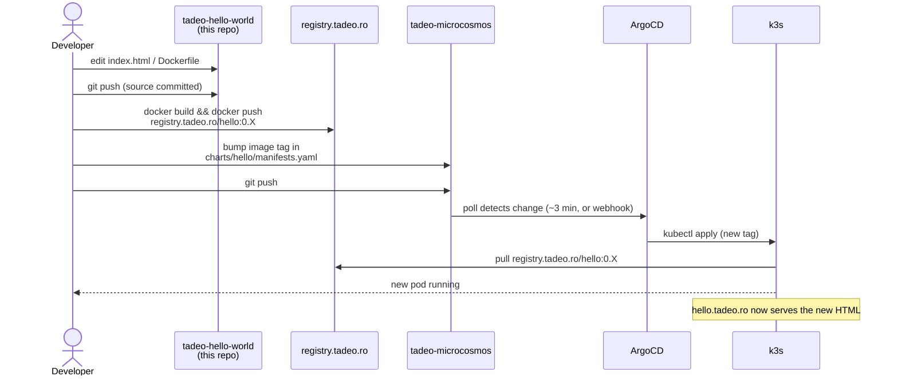

# tadeo-hello-world

A deliberately tiny static page deployed at https://hello.tadeo.ro.

It exists to be **the canary for the [tadeo microcosmos](https://github.com/rtodea/tadeo-microcosmos)** — a single URL whose `200 OK` proves that every layer of the stack is alive.

## What a 200 from `https://hello.tadeo.ro` actually proves

Each numbered hop on the way to the page is a piece of infrastructure that has to be working correctly. If the page renders, all of them are.



Concretely, a green smoke-test response means **all of the following are healthy at once**:

| Layer | Healthy because the page rendered |
|---|---|
| Cloudflare DNS | `*.tadeo.ro` resolves to the right IP |
| Hetzner network / firewall | TCP/443 reaches the host |
| TLS / cert-manager | Browser trusts the wildcard cert (no MITM, no expiry, no DNS-01 failure) |
| k3s networking (klipper-lb, CNI) | Packets reach Traefik, Traefik reaches the Pod |
| Traefik | Host rule matched and routed |
| Pod | Container is running and answering on `:80` |
| `registry.tadeo.ro` | Originally served the `hello:0.X` image when k3s pulled it |
| ArgoCD | Applied the manifests in [tadeo-microcosmos](https://github.com/rtodea/tadeo-microcosmos) that created all this |

If `hello.tadeo.ro` is broken, it's worth checking each row above in order — that's the troubleshooting path for the whole microcosmos.

## How an update flows (this repo to live page)



Two repos, on purpose: source here, deployment intent in [tadeo-microcosmos](https://github.com/rtodea/tadeo-microcosmos). Same pattern other apps in the microcosmos follow (`streaming-101`, etc).

## Build and push

```bash
# build
docker build -t registry.tadeo.ro/hello:0.X .

# log into the registry (creds in ~/.config/registry/env on the server)
. ~/.config/registry/env
echo "$REGISTRY_PASSWORD" | docker login registry.tadeo.ro -u "$REGISTRY_USER" --password-stdin

# push
docker push registry.tadeo.ro/hello:0.X
```

Then in [tadeo-microcosmos](https://github.com/rtodea/tadeo-microcosmos), bump the image tag in `charts/hello/manifests.yaml` and `git push`. ArgoCD picks it up within ~3 minutes (or click "Refresh" in the UI).

## Local preview without docker

`index.html` is self-contained — no build step, no JS dependencies beyond a `setInterval` clock. Open it directly in a browser to preview.

## License

MIT — it's literally a hello world.
